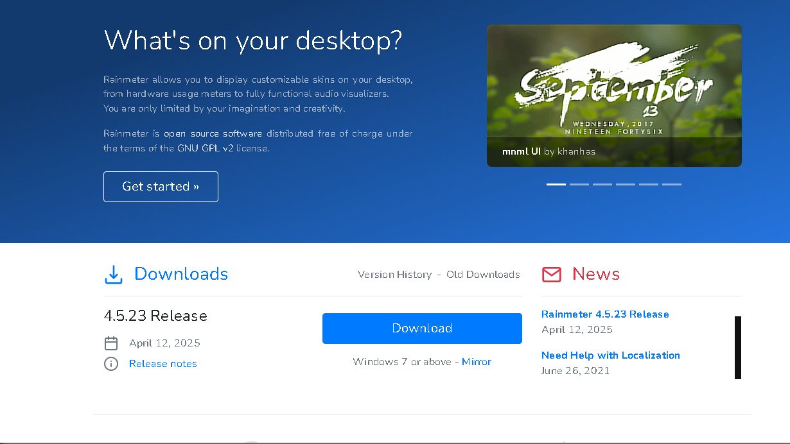
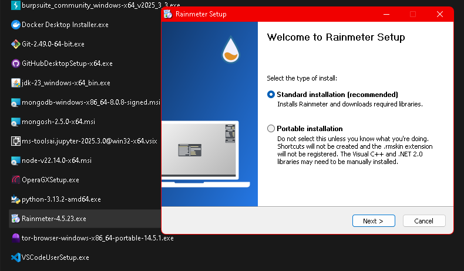
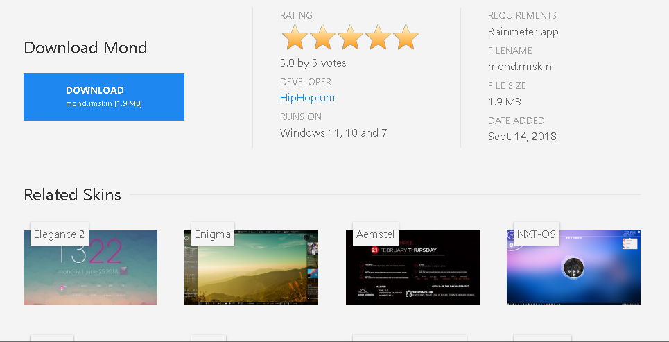
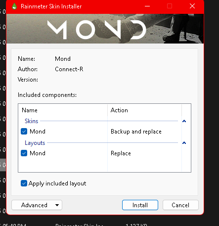

### 🔹 **Step 1: Download Rainmeter**

* Visit [Rain Meter](https://www.rainmeter.net)
* Click the “Download Final” button
* Works on Windows 7 and above

---

### 🔹 **Step 2: Install Rainmeter**

* Open the `.exe` file you downloaded
* Choose **Standard Installation**
* Follow the setup wizard and finish install
* Rainmeter will launch on startup

---

### 🔹 **Step 3: Find a Skin**

* Go to sites like:

  * [DeviantArt](https://www.deviantart.com/rainmeter)
  * [VisualSkins](https://visualskins.com)
  * Reddit: [r/Rainmeter](https://reddit.com/r/rainmeter)
* Download `.rmskin` or `.zip` format

> Here I used this skin  [Mond Rainmeter Theme](https://visualskins.com/skin/mond) 

---

### 🔹 **Step 4: Install .rmskin File**

* Double-click the `.rmskin` file

### 🔹 **Step 5: Install the skin**

* Rainmeter's Skin Installer will open
* Click **Install**
* Done!

---

### 🔹 **Step 6: All Set! Enjoy Your New Desktop**

* Combine multiple skins for custom layout
* Use Rainmeter **Manage** window to arrange, load, unload
* Save layout if you want to switch later

---

## 📌 Additional Tips:

* Right-click widgets to access skin options
* Use **Rainmeter Skin Packager** to create `.rmskin` from custom builds
* You can edit the skin too
* Join **r/Rainmeter** for ideas, help, and inspiration
* Some skins require **plugins** — download as needed (Rainmeter will prompt)
